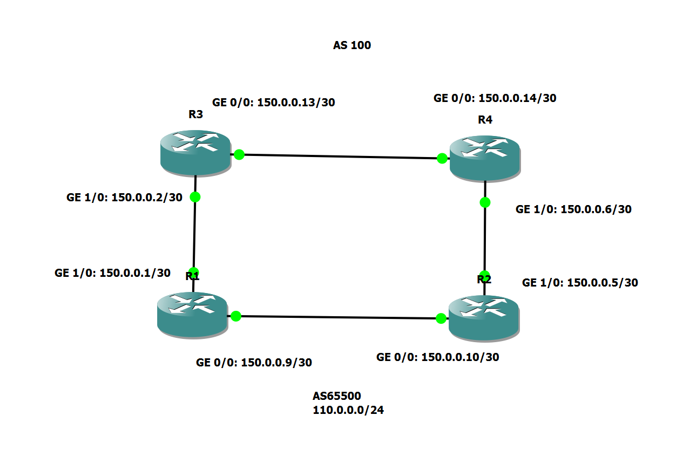

# BGP Routing on Cisco


## ISP AS Number: **100**

## Customer AS Number: **65500**

## Network broadcasted over BGP: **110.0.0.0/24**

## Configuring Router R1
---
### Configure Interface IP Addresses

```
R1(config)# interface gigabitEthernet 0/0
R1(config-if)# ip address 150.0.0.9 255.255.255.252
R1(config-if)# no shutdown

R1(config)# interface gigabitEthernet 1/0
R1(config-if)# ip address 150.0.0.1 255.255.255.252
R1(config-if)# no shutdown
```

### Configure BGP

```
R1(config)# router bgp 65500
R1(config-router)# neighbor 150.0.0.10 remote-as 65500
R1(config-router)# neighbor 150.0.0.2 remote-as 100
R1(config-router)# neighbor 150.0.0.10 next-hop-self
```

## Configuring Router R2
---
### Configure Interface IP Addresses

```
R2(config)# interface gigabitEthernet 0/0
R2(config-if)# ip address 150.0.0.10 255.255.255.252
R2(config-if)# no shutdown

R2(config)# interface gigabitEthernet 1/0
R2(config-if)# ip address 150.0.0.5 255.255.255.252
R2(config-if)# no shutdown
```

### Configure BGP

```
R2(config)# router bgp 65500
R2(config-router)# neighbor 150.0.0.9 remote-as 65500
R2(config-router)# neighbor 150.0.0.6 remote-as 100
R2(config-router)# neighbor 150.0.0.9 next-hop-self
```

### Configure Loopback for Testing

```
R2(config)# interface loopback0
R2(config-if)# ip address 110.0.0.1 255.255.255.0
```

## Configuring Router R3
---
### Configure Interface IP Addresses

```
R3(config)# interface gigabitEthernet 0/0
R3(config-if)# ip address 150.0.0.13 255.255.255.252
R3(config-if)# no shutdown

R3(config)# interface gigabitEthernet 1/0
R3(config-if)# ip address 150.0.0.2 255.255.255.252
R3(config-if)# no shutdown
```

### Configure BGP

```
R3(config)# router bgp 100
R3(config-router)# neighbor 150.0.0.14 remote-as 100
R3(config-router)# neighbor 150.0.0.1 remote-as 65500
R3(config-router)# neighbor 150.0.0.14 next-hop-self
```

## Configuring Router R4
---
### Configure Interface IP Addresses

```
R4(config)# interface gigabitEthernet 0/0
R4(config-if)# ip address 150.0.0.14 255.255.255.252
R4(config-if)# no shutdown

R4(config)# interface gigabitEthernet 0/0
R4(config-if)# ip address 150.0.0.6 255.255.255.252
R4(config-if)# no shutdown
```

### Configure BGP

```
R4(config)# router bgp 100
R4(config-router)# neighbor 150.0.0.13 remote-as 100
R4(config-router)# neighbor 150.0.0.5 remote-as 65500
R4(config-router)# neighbor 150.0.0.13 next-hop-self
```

## Useful BGP Commands

```
R1# show ip bgp summary - View summerised info on BGP
R1# show ip bgp neighbors - View information about each neightbor
R1# show ip route bgp - View BGP routing information