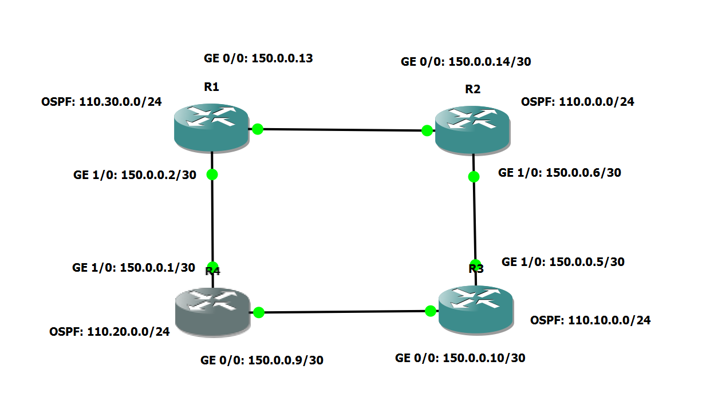

# OSPF Routing on Cisco


## OSPF Process ID: **1**

## OSPF Area: **0**

## Networks broadcasted over OSPF: **110.0.0.0/24, 110.10.0.0/24, 110.20.0.0/24, 110.30.0.0/24**

## Configuring Router R1
---

### Configure OSPF

```
R1(config)# router ospf 1
```

### Configure Interface IP Addresses

```
R1(config)# interface gigabitEthernet 0/0
R1(config-if)# ip address 150.0.0.13 255.255.255.252
R1(config-if)# ip ospf 1 area 0
R1(config-if)# no shutdown

R1(config)# interface gigabitEthernet 1/0
R1(config-if)# ip address 150.0.0.2 255.255.255.252
R1(config-if)# ip ospf 1 area 0
R1(config-if)# no shutdown
```

## Configuring Router R2
---

### Configure OSPF

```
R2(config)# router ospf 1
```
### Configure Interface IP Addresses

```
R2(config)# interface gigabitEthernet 0/0
R2(config-if)# ip address 150.0.0.14 255.255.255.252
R2(config-if)# ip ospf 1 area 0
R2(config-if)# no shutdown

R2(config)# interface gigabitEthernet 1/0
R2(config-if)# ip address 150.0.0.6 255.255.255.252
R2(config-if)# ip ospf 1 area 0
R2(config-if)# no shutdown
```

## Configuring Router R3
---
### Configure OSPF

```
R3(config)# router ospf 1
```
### Configure Interface IP Addresses

```
R3(config)# interface gigabitEthernet 0/0
R3(config-if)# ip address 150.0.0.10 255.255.255.252
R3(config-if)# ip ospf 1 area 0
R3(config-if)# no shutdown

R3(config)# interface gigabitEthernet 1/0
R3(config-if)# ip address 150.0.0.5 255.255.255.252
R3(config-if)# ip ospf 1 area 0
R3(config-if)# no shutdown
```

## Configuring Router R4
---
### Configure OSPF

```
R4(config)# router ospf 1
```
### Configure Interface IP Addresses

```
R4(config)# interface gigabitEthernet 0/0
R4(config-if)# ip address 150.0.0.9 255.255.255.252
R4(config-if)# ip ospf 1 area 0
R4(config-if)# no shutdown

R4(config)# interface gigabitEthernet 0/0
R4(config-if)# ip address 150.0.0.1 255.255.255.252
R4(config-if)# ip ospf 1 area 0
R4(config-if)# no shutdown
```

## Useful OSPF Commands
---
```
R1# show ip ospf neighbors - View information about each neightbor
R1# show ip route ospf - View OSPF routing information